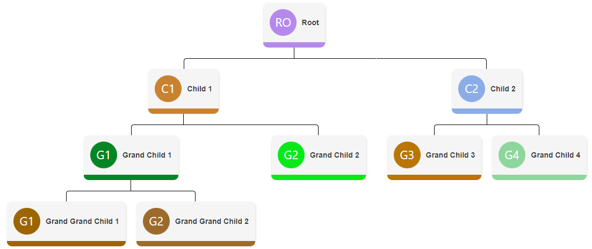
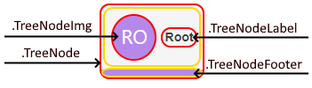
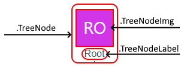

# Overview Qodly_OrgTree

Qodly organizational tree Component using [react-organizational-chart](https://apexcharts.com/)

## Tree

Pie and donut charts are the same, with the only difference being that the donut chart has a hole in the center.
The DataSource can be exactly the same for both of them.



| Name                  | Type    | Description                                                                                                                         |
| --------------------- | ------- | ----------------------------------------------------------------------------------------------------------------------------------- |
| `Tree line height`    | String  | Height of the lines in the tree  (By default  "20px")                                                                               |
| `Tree line thickness` | String  | Thickness of the lines in the tree  (By default  "1px")                                                                             |
| `Tree line color`     | Color   | Color of the lines in the tree  (By default  "#000")                                                                                |
| `Tree line style`     | String  | Style of the lines in the tree, the value can be among the following: `solid`, `dotted`, `dashed`. By default the value is `solid`. |
| `Tree line radius`    | String  | Radius of the corner of the lines in the tree  (By default  "0px")                                                                  |
| `Tree node padding`   | String  | Space between each node in the tree  (By default  "5px")                                                                            |
| `Tree node type`      | String  | Predefined style of the nodes in the tree, the value can be among the following: `default`, `full`, `empty`.                        |
| `With photos`         | Boolean | Define if the tree should display photos. By default, photos are automatically generated using the initials of the name.            |

#### DataSource

The datasource can be a JSON object string (JSON stringified).
Here is the structure of the data that can be used :
| Name               | Type   | Required | Description                                                                                                                         |
| ------------------ | ------ | -------- | ----------------------------------------------------------------------------------------------------------------------------------- |
| `label`            | String | Yes      | Name of the root node.                                                                                                              |
| `photo`            | Array  | No       | Photo of the root node.                                                                                                             |
| `children`         | Array  | Yes      | Array of children nodes.                                                                                                            |
| `lineHeight`       | String | No       | Height of the lines in the tree  (By default  "20px")                                                                               |
| `lineWidth`        | String | No       | Thickness of the lines in the tree  (By default  "1px")                                                                             |
| `lineColor`        | String | No       | Color of the lines in the tree  (By default  "#000")                                                                                |
| `lineStyle`        | String | No       | Style of the lines in the tree, the value can be among the following: `solid`, `dotted`, `dashed`. By default the value is `solid`. |
| `lineBorderRadius` | String | No       | Radius of the corner of the lines in the tree  (By default  "0px")                                                                  |
| `nodePadding`      | String | No       | Space between each node in the tree  (By default  "5px")                                                                            |

The children nodes have this structure :
| Name       | Type   | Required | Description                |
| ---------- | ------ | -------- | -------------------------- |
| `label`    | String | Yes      | Name of the current node.  |
| `photo`    | Array  | No       | Photo of the current node. |
| `children` | Array  | Yes      | Array of children nodes.   |

an example of data that can be used :

```Json
{
    "label": "Root",
    "children": [
        {
            "label": "Child 1",
            "children": [
                {
                    "label": "Grand Child",
                    "children": []
                }
            ]
        },
        {
            "label": "Child 2",
            "children": [
                {
                    "label": "Grand Child",
                    "children": [
                        {
                            "label": "Great Grand Child 1",
                            "children": []
                        },
                        {
                            "label": "Great Grand Child 2",
                            "children": []
                        }
                    ]
                }
            ]
        },
        {
            "label": "Child 3",
            "children": [
                {
                    "label": "Grand Child 1",
                    "children": []
                },
                {
                    "label": "Grand Child 2",
                    "children": []
                }
            ]
        }
    ]
}
```

## Custom CSS
To customize the tree, you can use the following CSS classes :
| Name             | Description                                                                                 |
| ---------------- | ------------------------------------------------------------------------------------------- |
| `TreeNode`       | Class of the nodes.                                                                         |
| `TreeNodeImg`    | Class of the image in the nodes. Only available if the `With photos` prop is set to `true`. |
| `TreeNodeLabel`  | Class of the label in the nodes.                                                            |
| `TreeNodeFooter` | Class of the footer in the nodes. Only available with the `nodeType` prop set to `default`. |

`default` node type :  


`full` node type & `empty` node type :  
